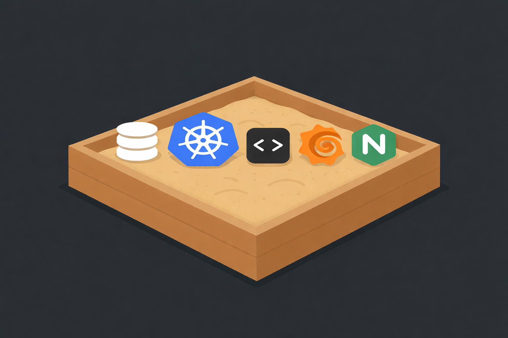

<h1 align="center">

  

Manal Petti

  

</h1>

## ABOUT

**Manal Petti (மணல் பெட்டி)** means Sandbox in Tamil.
Manal (மணல்) means sand, and Petti (பெட்டி) means box or container.

This repository contains code for my **BREAK–LEARN–FIX** sandbox environment.

It includes:
 - GitHub workflows for CI/CD
 - Kubernetes add-ons
 - Containerized applications

It is implemented in a way that allows it to be easily deployed on any Kubernetes flavor.

